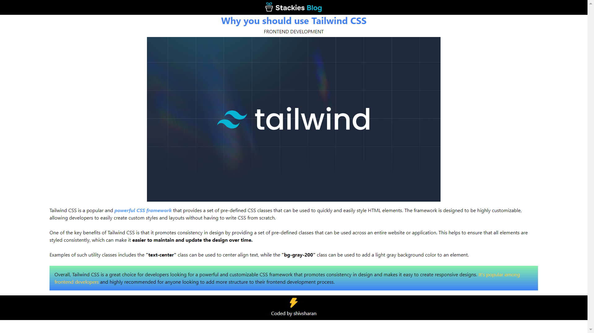

## Blog Page using Tailwind CSS Utility Classes
This is a sample blog page built using the popular CSS framework, Tailwind CSS. The blog page is styled using Tailwind's extensive set of utility classes, which allows for rapid and consistent styling of HTML elements without having to write custom CSS.

# Getting Started
To get started, simply clone the repository and open the index.html file in your web browser. All necessary CSS styles are included in the dist/output.css file, which is generated from the src/tailwind.css file using the Tailwind CLI tool.

# Features
+ The blog page includes a header with a logo image and a navigation menu.
+ The main section includes an article with a title, subtitle, and body text.
+ The article also includes an image and multiple paragraphs, which are all styled using Tailwind's utility classes.
+ The footer includes an image and a credit line.

# Technologies Used
- HTML
- CSS
- Tailwind CSS

# Acknowledgments
This blog page is a sample project created for demonstration purposes only. The content and images used are not original and are used only for demonstration purposes. Tailwind CSS is an excellent framework for rapid development and is highly recommended for anyone looking to streamline their CSS workflow.
